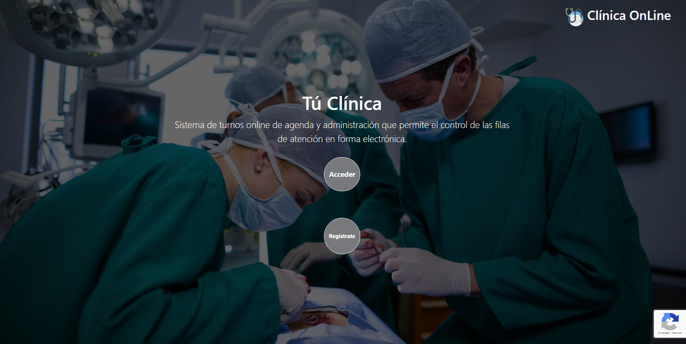
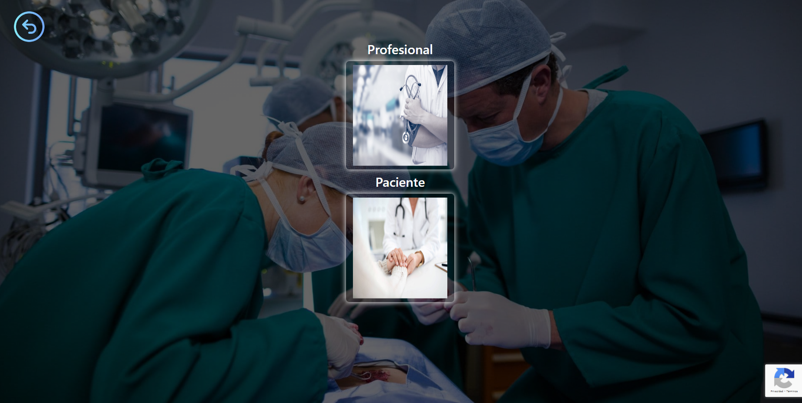
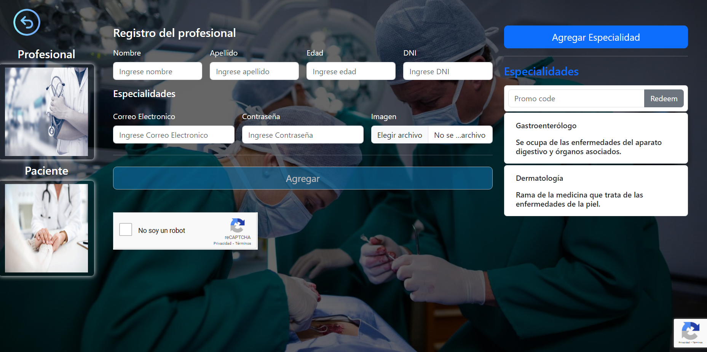
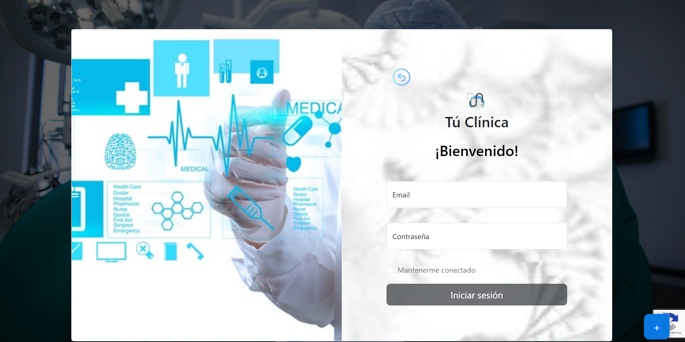
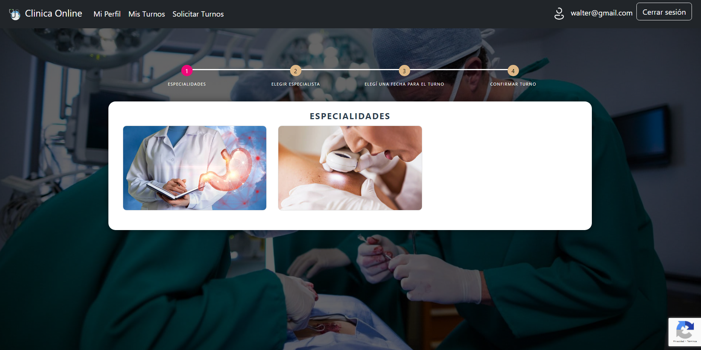
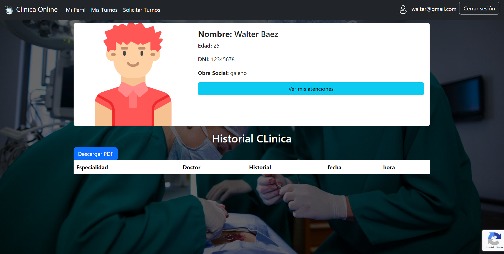

# :hospital: Clínica OnLine

Para quienes buscan brindar un servicio moderno,
que facilite el intercambio paciente-profesional,
sin contratiempos,
presentamos la [Clínica OnLine](https://tp-clinica-utn.web.app/auth/bienvenido):

Un sistema de gestión de turnos ideado para instituciones dedicadas a la Salud,
que les permite destacarse no sólo por la calidad de su atención médica,
sino también por brindar una experiencia de usuario satisfactoria
tanto a los pacientes como a especialistas y administradores.

## Secciones

**Primero se ingresa al sistema.**

Una vez dentro, las diferentes secciones aquí expuestas son fácilmente accesibles a través del *menú*,
visible a lo largo de toda la aplicación.

Cada tipo de usuario cuenta con un acceso personalizado acorde a su rol.

### :heavy_check_mark: Página de bienvenida

### :heavy_check_mark: Registro

Disponible para pacientes y especialistas.

Luego de registrarse, los pacientes *deben verificar su correo electrónico*
antes de ingresar por primera vez y los profesionales deben de estar aprobados por el administrador.

Ejemplo:

### :heavy_check_mark: Login

Brinda acceso a pacientes, especialistas y administradores por igual,
siempre y cuando se encuentren *verificados* o *habilitados*.

### :heavy_check_mark: Solicitar turno

Diseñada para que los pacientes puedan **pedir turno** en 3 simples pasos.

Los administradores *también* pueden solicitar turno en nombre de algún paciente
que así lo desee.

### :heavy_check_mark: Turnos / Mis turnos

Aquí, pacientes y especialistas pueden **ver sus turnos pendientes y realizados**, al detalle.

Los administradores pueden ver *todos* los turnos de la clínica.

Además, desde esta sección se van a poder **administrar los turnos reservados**.

Cualquier usuario puede, por ejemplo, **cancelar un turno** explicando el motivo:

### :heavy_check_mark: Mi perfil

Muestra la **información personal** del usuario logeado.

### :heavy_check_mark: Usuarios

En esta sección, los administradores (sólo los administradores) pueden **ver información
acerca de todos los usuarios**, habilitar o deshabilitar el acceso a especialistas...

...y **generar nuevos usuarios** de *cualquier* tipo:

# tp-clinica-utn
# tp-clinica-utn
# tp-clinica-utn
# tp-clinica-utn
# tp-clinica-utn
